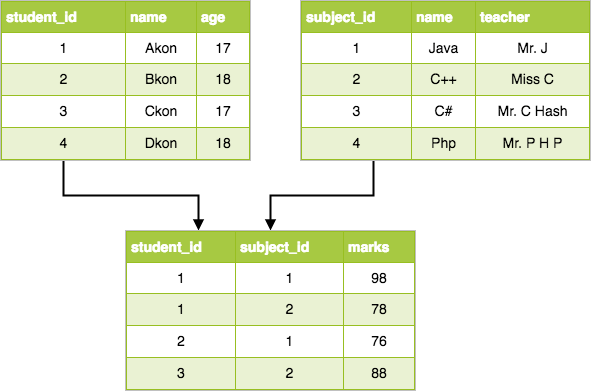
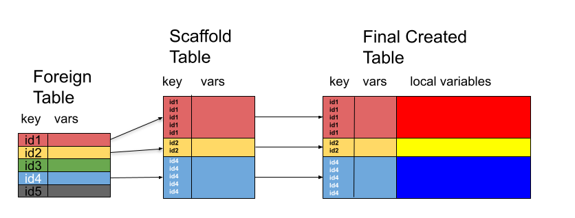

# Relational Data
## Model



## Model: Each Table is Simple Rectangular data

- Multiple rectangular tables
- Data related via shared variables
  - called a *foreign key* relationship

## Foreign Key Relationship Examples

- Patients[PatientID] -> Dr_Visits[PatientID]
  - patient can have 0, 1, or many visits
- Purchases[CustomerID, StoreID, ProductID] -> Customers[CustomerID], Stores[StoreID], Products[ProductID]

## Enter Müller's `dm` Package

- Combine `data.frame`s into relational database
- Declare foreign key style relationships
- Check if the data meet constraints imposed by foreign keys

## `dm` is great so why are we here?

- `dm` assumes data already exists
- No tooling for *simulating* data under relational constraints

# Simulating Relational, Interdependent Data

## Two Types of Data Interdependence

- Intratable
- Intertable

## Intratable Dependencies Between Variables

When simulating artificial data

- height depends on gender
- Highest education level depends on age
- End date depends on start date
- etc

## Intertable Dependencies

- Foreign key relationships as discussed above
- Can't generate adverse event records for patients until patient data is simulated
- Can't simulate purchase records without knowing 
  - what stores, items exist
  - which stores carried which items across which dates
- etc


# `respectables`

## Recipes for Independent Tables - Modularizing Data Simulation

`tbl_df` containing the following list  columns:

- `variables` -variables to generate
- `dependencies` - variable depenedencies
- `func` - function to generatate data
- `func_args` - [list] arguments for `func`
- `keep` - [logical] should `variables` be kept


## Recipes cont

- Each row declares how data for one or more variables should be generated
- Rows can appear in any order
  - `respectables` determines run order based on dependency declaration
- Simulation logic is declare modularly
  - Thus can be tested modularly
  
## Example Independent Data Table - Silly Customer Data

- `ID` - unique customer ID
- `STUFFLEVEL` - randomly sampled from `high` and `low` values
- `KEYSIZE` - normally distributed with mean depending on `STUFFLEVEL`
- `ACCT_OPEN` - date account was opened
- `ACCT_CLOSED` - date account was closed (or NA if still open)


## Data Generating Functions: KEYSIZE

```{r}
keysize <- function(n, .df, low = 20, high = 50) {
    levmean <- ifelse(.df$STUFFLEVEL == "high", high, low)
    rnorm(nrow(.df), mean = levmean, sd = 15)
}

keysize(.df = data.frame(STUFFLEVEL = rep("high", 2)))
```


## Data Generating Functions: ACCT_* Dates

```{r}
acct_dates <- function(n, firstopen, lastclose = Sys.Date(), p_closed = .15) {
    starts <- rand_posixct(n = n, start = firstopen, end = lastclose)
    ends <- rand_posixct(n = n, start = starts, end = lastclose)
    if(p_closed > 0) { 
        nainds <- sample(seq_len(n), n - floor(n * p_closed), replace = FALSE)
        ends[nainds] <- NA
    }
    data.frame(ACCT_OPEN=starts, ACCT_CLOSED=ends)
}

acct_dates(2, firstopen = "2010-01-01")
```

## Recipe

```{r}
acctdate_vars <- c("ACCT_OPEN", "ACCT_CLOSED")
recipe <- tribble(~variables,   ~dependencies, ~func,          ~func_args,                   ~keep,
                  "ID",         no_deps,      "subjid_func",  list(prefix="ID", sep=""),     TRUE,
                  "STUFFLEVEL", no_deps,      sample_fct,     list(x = c("high", "low")),    TRUE,
                  "KEYSIZE",    "STUFFLEVEL", "keysize",      NULL,                          TRUE,
                  acctdate_vars, no_deps,     "acct_dates",   list(firstopen = "2015-01-01",
                                                                   lastclose = Sys.Date()),  TRUE)

```

## Silly Data

```{r}
sillydata <- gen_table_data(N = 500, recipe = recipe)
head(sillydata)
```


## Silly Data - The `dplyr` Way

```{r}
library(dplyr)
sillydata2 <- data.frame(ID = subjid_func(n = 500, prefix = "ID", sep = "")) %>%
    mutate(STUFFLEVEL = sample_fct(n = n(), x = c("high", "low")),
           KEYSIZE = rnorm(n(), mean = ifelse(STUFFLEVEL == "high", 50, 20), sd = 15),
           ACCT_OPEN = rand_posixct(n = n(), start = "2015-01-01", end = Sys.Date()),
           ACCT_CLOSE = rand_posixct(n = n(), start = ACCT_OPEN, end = Sys.Date()),
           ACCT_CLOSE = na_if(ACCT_CLOSE, runif(n()) <= .15))
head(sillydata2)
```

## Recipes Are Still Nice

```{r}

recipe2 <- recipe
recipe2$func_args[[3]] <- list(high=20, low = 50)

sillydata2 <- gen_table_data(N= 500, recipe = recipe2)
head(sillydata2)
```


## Also

Sometimes you really do want to *jointly* generate 2+ variables

- Not in `mutate()` land anymore
- Need a pipeable wrapper around your logic
  - ` function(x, ...) cbind(x, real_logic(x, ...))`
  - Doable, of course, but doesn't really add anything
  
# Simulating Data Under Foreign-Key Constraints

## Scaffold Tables And Scaffolding Join Recipes

```{r, echo = FALSE}

```

## Two Stage Process

- Scaffolding - Determine dimensions based on foreign table

- Data Generation - Normal 


# Speaking With Silly Wallets - Our Sillyfolk Go Shopping


## Sillyfolk Are Silly Shoppers

- Some open an account but never go shopping
- Some go shopping many times
- All buy only one item per store visit
  - At random from items currently being sold
  - regardless of previous purchases

## Scaffolding: Random Events Per Id

- `rand_per_key` function factory
  - takes `keyvar`, `mincount`, `maxcount`, and `prop_present`
  - returns scaffolding function suitable for use in scaffolding join recipe

## Sillyfolk Shopping Trips

```{r}

sjfun <- rand_per_key("ID", mincount = 0, maxcount = 5, prop_present = 1)

scaff <- sjfun(.dbtab = sillydata)
table(table(scaff$ID))
```

```{r}
length(unique(scaff$ID))
```

## Our Scaffolding Join Recipe

```{r}
sjrecipe <- tribble(~foreign_tbl, ~foreign_key, ~func,  ~func_args,
                    "sillydata",  "ID",         sjfun,  list())
```

## What To Buy When Silly Shopping

```{r}
## lookup table for products and when they were available for purchase
products <- tribble(~PRODUCTID, ~DESC,          ~AVAIL_ST,    ~AVAIL_END,
                    "PROD1",    "Doodad",       "2010-01-01", Sys.time(),
                    "PROD2",    "HLight Fluid", "2010-01-01", Sys.time(),
                    "PROD3",    "Mcguffin",     "2017-01-01", as.POSIXct("2017-12-31"),
                    "PROD4",    "Spanner",      "2010-01-01", Sys.time(),
                    "PROD5",    "Thingbat",     "2015-03-03", Sys.time(),
                    "PROD6",    "Thingbat v2",  "2018-03-03", Sys.time())
```

## Creating Buys

We define `buydate_func` which

- Accepts .df which contains `ID`, `ACCT_OPEN` and `ACCT_CLOSE`
- Creates `BUYDATE` and `BUYID` such that
  - `BUYID` are sequental globally
  - `BUYDATE` are sequential within `ID`
  
## For Posterity

```{r}
buycols <- c("BUYID", "BUYDATE")
buydate_func <- function(n, .df, end = Sys.time()) {
    n <- nrow(.df)
    starts <- .df$ACCT_OPEN
    ends <- .df$ACCT_CLOSED
    ends[is.na(end)] <- end
    dates <- rand_posixct(start = starts, end = ends, n = n)
    ids <- .df$ID
    odates <- order(ids, dates)
    revit <- order(order(dates))
    
    toret <- data.frame(BUYID = seq_len(n)[revit], BUYDATE = dates, stringsAsFactors = FALSE)
    toret[odates,]
}
```

## Deciding What To Buy

`prods_func` 

- Accepts `.df` containing `BUYDATE`
- Determines what products were avaialable on `BUYDATE` for each transaction
- Randomly selects an available product per transaction

## Posterity Once Again

```{r}
prodcols <- c("PRODUCTID", "DESC")
prods_func <- function(n, .df) {
    n <- NROW(.df)
    BUYDATE <- .df$BUYDATE
    pstarts <- as.POSIXct(products$AVAIL_ST)
    pends <- products$AVAIL_END
    rows <- lapply(BUYDATE,
                   function(bdt) {
        pids <- products$PRODUCTID[pstarts <= bdt & bdt <= pends]
        bought <- sample(pids, 1)
        products[products$PRODUCTID==bought,]
    })

    do.call(rbind, rows)[,prodcols]
}
```

## Our Silly Shopping Recipe

```{r}
buycoldeps <- c("ID", acctdate_vars)
buys_rec <- tribble(~variables, ~dependencies,  ~func,          ~func_args, ~keep,
                    buycols,    buycoldeps,     "buydate_func", NULL,       TRUE,
                    prodcols,   "BUYDATE",      "prods_func",   NULL,       TRUE) 

buysdf <- gen_reljoin_table(sjrecipe, buys_rec, db = list(sillydata = sillydata),
                            )
head(buysdf[, c("ID", buycols, prodcols)])
```
