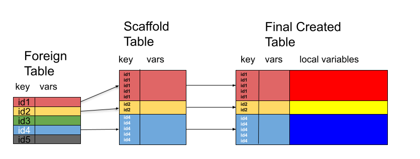

## Introduction and Motivations

Synthetic data provides a privacy-safe mechanism for developing,
benchmarking, testing, and showcasing analysis plans and
pipelines. Generating rectangular synthetic data is relatively
straightforward within R, using a combination of the in-built
sampling functions and either dplyr's mutate or simple data.frame 
object manipulation.

Many crucial types of data, however, involve inter-related types of 
normalized (in the database sense) data, with columns in one table
acting as keys or lookups within another. An example of this is the
CDISC data standard for clinical trial data, which has some tables
which contain one row per patient (ADSL) and other tables in which
a patient might have 0, 1, or many rows (ADAE). 

Furthermore, when synthesizing in one of these 0 to many records per
patient type tables, the distributions to sample observations from are
often conditional on information (typically demographic or study
structure, ie Arm, in CDISC) from the table which originates the key.

The utilities in this package provide a framework to define recipes
for both the foreign-key/implicit join and distributional
conditionality aspects of this problem. We also provide machinery
for injecting randomness artificially into data (either synthetic
or real).

## 

## Recipes

### Table Recipes

A table recipe is a set of instructions sufficient to synthesize a
single rectangular dataset, including any conditionality or 
joint nature between variables within that single dataset.

The recipe is a tibble made up of one or more rows, with each row
defining the instructions to synthesize one or more variable in the
form of the following mandatory columns:

 - *variables* - (list column as needed) names of variables generated
   by that row. No empty/length 0 entries allowed.
 - *dependencies* - (list column). Names of variables which must have
   already been populated for the the variables in this row to be
   synthesized.
 - *func* - (list column) A function, or a character string which
   `lookup_fun` can resolve to one, that accepts `n`, `.df`, and `...`
   and returns either an atomic vector of length \code{n}, or a
   data.frame/tibble with n rows.
 - *func_args* - (list column) a list of arguments which should be
   passed to \code{func} in addition to `n` and `.df`.
 

To generate jointly-distributed synthetic variable data, we simply
specify more than one variable in the `variables` column, and specify
a `func` which returns a data.frame containing all synthesized
variables together.

To generate conditionally-distributed synthetic variables, we specify
one or more variables in the `dependencies` column. when this occurs,
the variables named in that row's `variables` value will not be
generated until after all the named dependency variables have been
synthesized, and `func` will be passed the current partially
synthesized dataset as the `.df` parameter. The body of the function
can then use those values however the recipe-creator desires to
generated the required covariance/conditionality structure.

### Scaffold Tables and Scaffolding Join Recipes

Tables oftentimes do not live in isolation; rather they live with
implicit or explicit relationships with other tables. In these cases,
when constructing synthetic or synthesized data, the tables cannot be
created independently of eachother. Thus we require a way of
implementing, *before the data construction step* these
relationships. Relational databases do this via schema, but this is
focused on data storage, rather than its construction. 

In the context of the construction of interrelated tables, we define
the *scaffold table* for a to-be-constructed dependant table --- in
our formulation one that once constructed, will have a foreign key
relationship with another already existing table --- as a table which
contains the foreign key values and, optionally any other values from
the foreign table, that will ultimately appear in the created table,
but none of the variables which will reside primarily in the new
table. We note that the foreign key values in the *scaffold table* need not
be unique, as they would generally be in the foreign table, and that not all
of the values for the key present in the foreign table need appear in the
scaffold table, as seen below.



We define a *scaffolding join recipe* as a recipe which creates the
*scaffold table* for a prospective data table given a collection
of already existing tables which contains

A scaffolding join recipe is a tibble with the following columnns:

- *foreign_tbl* - The name of the foreign table in which to find the
  key
- *foreign_key* - The name of the variable in `foreign_tbl` that will
  act as a foreign key
- *foreign_deps* - Name(s) of variables in `foreign_tbl` that act as
  dependencies for generating those named in `variables`

followed by the standard mandatory columns of a table recipe.

The difference between the process of synthesizing data from a
scaffolding join recipe and a table recipe, is that in the scaffold
recipe `func` can generate data of any dimension, provided that it
contains the `foreign_key` variable populated only with (possibly
duplicated) values which appear in that column of `foreign_tbl`. This
is then *Right Outer Joined* to the foreign table to create the 
scaffold table of the desired dimensions containing the data in `foreign_tbl` subsetted
and replicated as necessary for the merge.

This newly dimensioned *scaffold table* is intended to be used as a
starting point for synthesizing the remaining desired variables using
a table recipe.

### ConstrMissingness Recipes

A missingness recipe is a recipe similar to a table recipe, the
differences being that there is no `dependencies` column and the
`func` column contains a function will return a logical vector with a
length equal to the number of rows in the synthesized data, with
`TRUE` indicating missingness. This function will be called and the
resulting missingness injected, in order, so non-independent
missingness accross columns is achievable if desired.

## Constructing Data with Recipes

### Individual Table

individual tables are created from *data table recipes* using `gen_table_data`, which takes
`N`, the number of rows to synthesize, `recipe` the recipe to use, and
`df` a starting point/partially generated dataset to which newly
synthesized data should be added.

Here we define a recipe for "sillydata", which has 3 variables, `ID`, 
`STUFFLEVEL`, and `KEYSIZE`, where:

- `ID` will containue unique values generated by `subjid_func`
- `STUFFLEVEL` will have values `"high"` and `"low"`, randomly sampled with `sample_fct`, and
- `KEYVALUE` is normalaly distributed conditional on `STUFFLEVEL`, with a mean of 50 for the `"high"` level and 20 for the `"low"`, as implemented by the `keysize` function.

```{r}
library(respectables)
library(dplyr)
keysize <- function(n, .df, ...) {
    levmean <- ifelse(.df$STUFFLEVEL == "high", 50, 20)
    rnorm(nrow(.df), mean = levmean, sd = 15)
}

recipe <- tribble(~variables, ~dependencies, ~func, ~func_args, ~keep,
                  "ID", no_deps, "subjid_func", list(prefix="ID", sep=""), TRUE,
                  "STUFFLEVEL", no_deps, sample_fct, list(x = c("high", "low")), TRUE,
                  "KEYSIZE", "STUFFLEVEL", "keysize", NULL, TRUE)

sillydata <- gen_table_data(N = 500, recipe = recipe)
head(sillydata)
```

We can see that the conditional distribution worked by plotting the data densities
for each `STUFFLEVEL` value
```{r}
library(ggplot2)
mu <- sillydata %>% group_by(STUFFLEVEL) %>% summarize(grp.mean = mean(KEYSIZE))
p<-ggplot(sillydata, aes(x=KEYSIZE, color=STUFFLEVEL)) +
  geom_density()+
  geom_vline(data=mu, aes(xintercept=grp.mean, color=STUFFLEVEL),
             linetype="dashed")
p
```

This process does the following:

- First, all rows in the recipe which do not have listed dependencies
  are applied in order
- Next the remaining rows are walked in order, and performed if their
  dependencies are met
  - This process is repeated until all rows have been applied or until
    a full pass through the remaining rows results in no rows being
    applied.
- Finally, the synthesized data are reorderd to match the order the
  variables appeared in the recipe (with `df` prepended if it was not
  `NULL`
  
  


